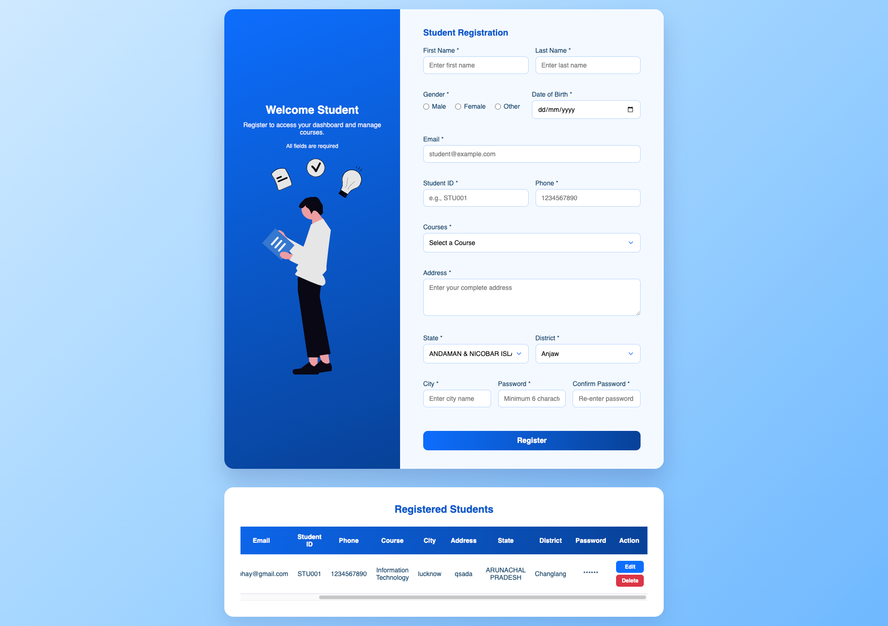

🎓 Student Registration System

A responsive Student Registration System built using HTML, CSS, and Vanilla JavaScript.
This project allows users to register students, validate form inputs, and manage student records in a dynamic table with edit and delete functionality.

🚀 Features

Modern and responsive UI

Two-column layout with welcome section

Complete student registration form

Client-side validation using JavaScript

Dynamic table to display registered students

Edit student details

Delete student records

Password confirmation validation

Success message on successful registration

Responsive table with horizontal scrolling

Clean and structured UI

🛠️ Technologies Used

HTML5 – Page structure

CSS3 – Styling, layout, and responsiveness

JavaScript (Vanilla JS) – Validation and dynamic DOM manipulation

📋 Form Fields

The form collects the following student details:

First Name

Last Name

Gender

Date of Birth

Email

Student ID

Phone Number

Course Selection

Address

State

District

City

Password

Confirm Password

⚙️ Functionalities
1️⃣ Form Validation

JavaScript validates the form before submission:

Names must contain only letters

Email must be in valid format

Student ID must follow format STU001

Phone number must contain 10 digits

Password must contain minimum 6 characters

Confirm password must match password

All fields are required

2️⃣ Add Student

When the form is submitted successfully:

Student data is added to the table

Password is displayed as hidden characters

Success message appears

3️⃣ Edit Student

Users can modify existing student data:

Clicking Edit loads the data back into the form

Submit button changes to Update

Updated data replaces the existing row

4️⃣ Delete Student

Users can remove student records:

Clicking Delete removes the row

A confirmation popup appears before deletion

📸 Preview

📂 Project Structure

```
Student-Registration-System
│
├── index.html
├── district.js
├── undraw_learning_qt7d.svg
├── screenshot.png
└── README.md
```

▶️ How to Run the Project

1️⃣ Clone the repository

git clone https://github.com/abhay-tiwari-iphtech/StudentForm

2️⃣ Open the project folder

3️⃣ Run the project by opening

index.html

in your browser.

🎯 Purpose of the Project

This project was built to practice:

Advanced HTML form design

Responsive UI layouts

JavaScript form validation

DOM manipulation

Dynamic table management

💡 Future Improvements

Possible improvements for this project:

Store student data in LocalStorage

Connect the form with a backend API

Add search and filter functionality

Export student data to CSV / Excel

Add pagination for large datasets

👨‍💻 Author

Abhay Tiwari

GitHub:
https://github.com/abhay-tiwari-iphtech
